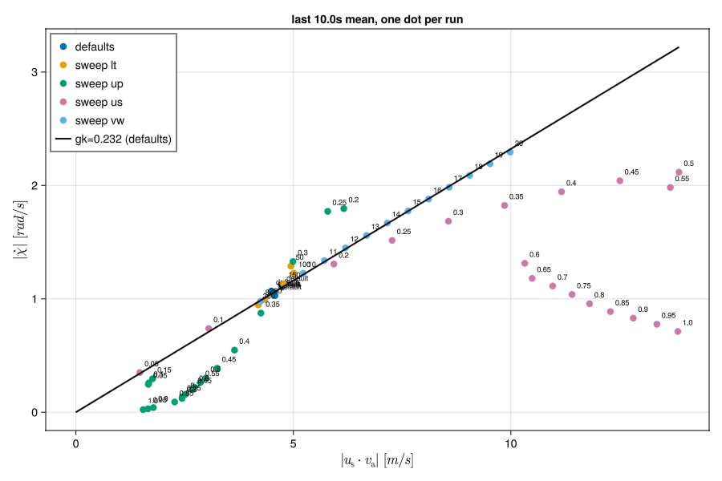
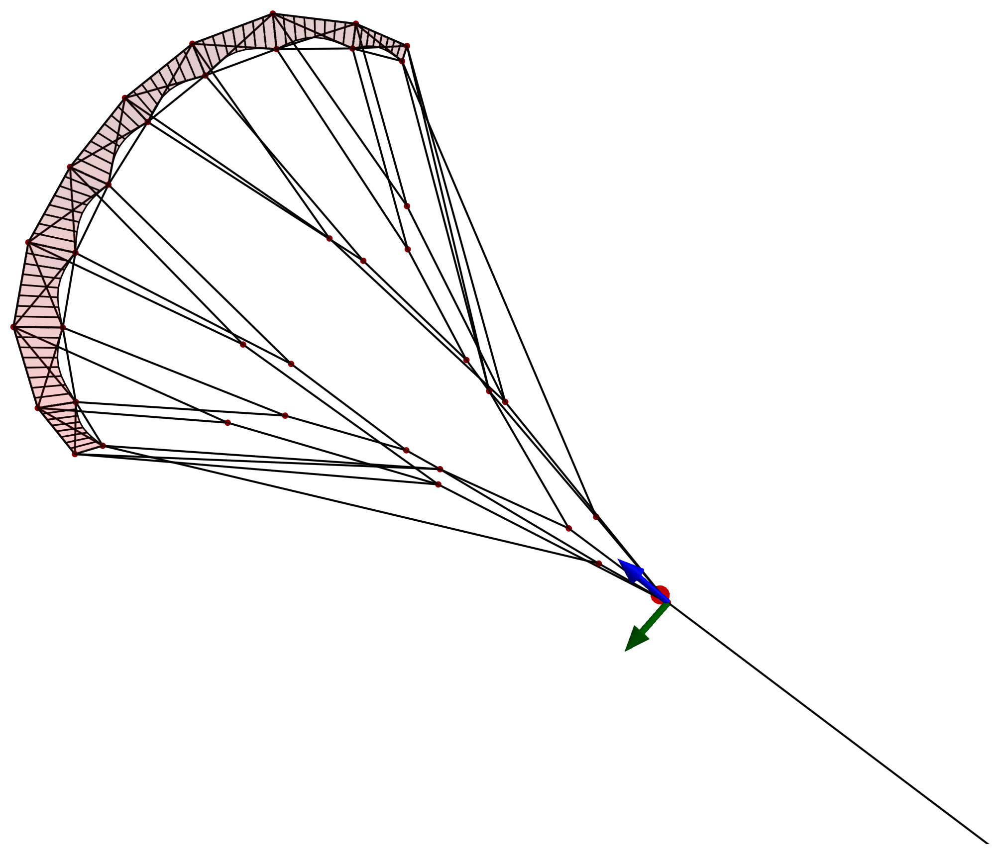
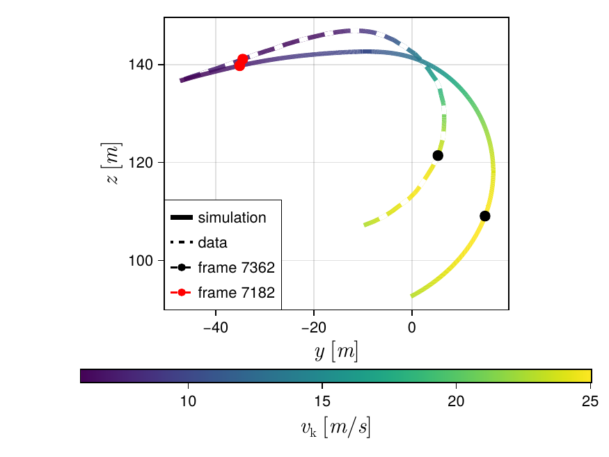
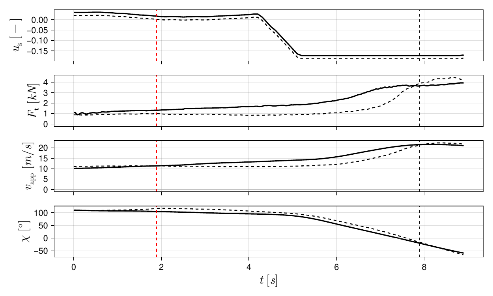
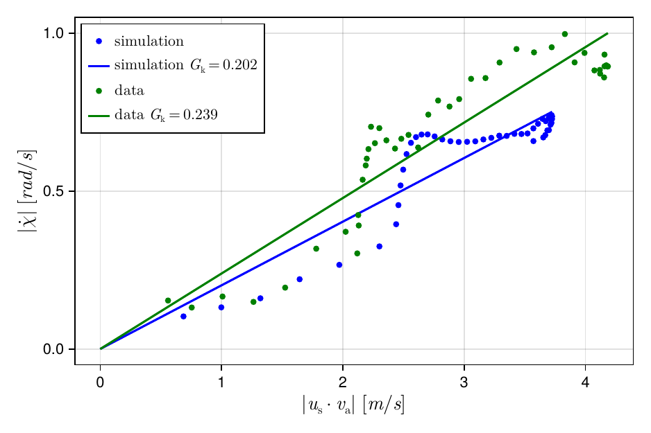
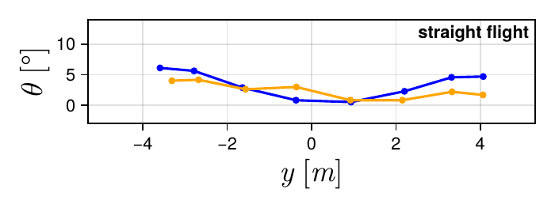
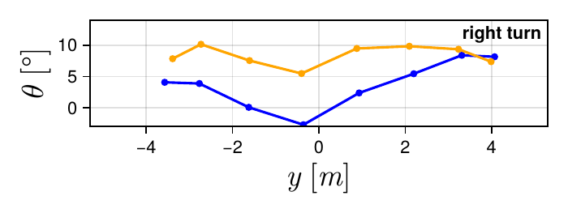

# V3Kite.jl

[](https://github.com/OpenSourceAWE/V3Kite.jl/actions/workflows/CI.yml?query=branch%3Amain)
[](https://opensource.org/licenses/MPL-2.0)

Julia package for simulation and validation of the TU Delft V3 leading edge
inflatable (LEI) kite. Built on
[SymbolicAWEModels.jl](https://github.com/OpenSourceAWE/SymbolicAWEModels.jl);
ships calibration, model setup, flight replay, and bundled V3 geometry.

## Installation

```bash
git clone https://github.com/OpenSourceAWE/V3Kite.jl
cd V3Kite.jl
./bin/install
./bin/run_julia
```

## Quick Start

```bash
./bin/run_julia
```

```julia
include("examples/menu.jl")
```

Pick an example from the menu. See `V3SimConfig` in `src/simulation.jl` for
the simulation options; bundled geometry and flight data live at
`v3_data_path()`.

> **First run is slow** (compilation + system build). Subsequent runs are
> fast — keep the same REPL open across runs.

You can make the first run much faster by using a custom system image. You can create it with the script `bin/create_system_image`. This requires up to 64GB RAM (for example 16GB physical RAM and a 48 GB swap file) and 30 min of time (on a laptop with a Ryzen 7840U CPU).

## Examples

All examples share one project — `julia --project=examples`. Run the
interactive launcher with `examples/menu.jl`, or pick one from the table:

| # | Script | What it does |
|---|--------|--------------|
| 1 | `v3kite.jl` | Hello-world: heading PID + 3D replay. Start here. |
| 2 | `reel_out_v3.jl` | Single reel-out maneuver, 2D Makie plots. |
| 3 | `realtime.jl` | Keyboard-controlled simulation (arrows steer/depower, ESC stops). |
| 4 | `open_loop.jl` | Settle in power zone, then ramped open-loop steering. |
| 5 | **`flight_replay.jl`** | Replays real EKF flight data through the simulator. See below. |
| 6 | **`batch_run_circles.jl`** | Parameter sweep of circular-flight runs. See below. |
| 7 | `batch_load_circles.jl` | Loads a batch directory; writes metrics CSV + scatter plot. |
| 8 | `batch_run_zenith_then_circles.jl` | Two-phase variant (zenith hold → circles). |
| 9 | `load_and_plot.jl` | Post-processes any saved log: timeseries, 3D replay, line stretch. |

Utilities (no simulation): `photogrammetry_aoa.jl`, `plot_wind_sources.jl`,
`depower_drum_model.jl`.

### Batch sweeps

`batch_run_circles.jl` runs a grid of circular-flight sims (settle → ramp
steering → early-stop on course-rate convergence), the study behind the second
paper ([Citation](#citation)). Logs land in
`processed_data/<batch_tag>/`; failures get listed in `failed_runs.txt`.
Edit `defaults`/`sweeps`/`combine_all` at the bottom of the script to
define the grid, then `include` it from the REPL:

```julia
include("examples/batch_run_circles.jl")
include("examples/batch_load_circles.jl")
```

`batch_run_circles.jl` runs one full sim per grid point, so a large sweep can
take a couple of hours.

Keep working in the same REPL session (the one from Quick Start) — each fresh
`julia` process re-runs precompilation, so staying in-session is much faster.
`batch_load_circles.jl` prompts for a batch directory and emits
`circles_batch_analysis.csv` plus the plot below.

`|u_s · v_a|` vs `|χ̇|`, one dot per run, with each dot labelled by its swept
value:

<p align="center"></p>

Legend — color marks which parameter was swept away from the baseline:

- `defaults` — the baseline run (all parameters at their default).
- `sweep us` — steering fraction.
- `sweep up` — depower (power) fraction.
- `sweep vw` — wind speed (m/s).
- `sweep lt` — tether length (m).
- `gk=… (defaults)` — turn-rate gain `G_k` fitted through the baseline run.

### Flight replay

`flight_replay.jl` slices a maneuver from an EKF H5 by UTC, settles the wing
into the recorded conditions, then steps the simulator while feeding recorded
steering/depower/tether inputs. A second `SymbolicAWEModel` driven straight
from the EKF state is replayed alongside. Outputs land in `processed_data/`;
PDFs go to `output/` when `SAVE_FIGS=true`. Toggles for maneuver, year,
feedback gains, and tape reductions are at the top of the script.

<p align="center"></p>

```julia
include("examples/flight_replay.jl")
```

The default run replays a 9 s straight-to-right-turn segment (V3 kite, Oct.
2025), the validation case from the paper ([Citation](#citation)). Stay in the
REPL afterwards: the script leaves a `plots` named tuple, so
evaluating a field opens that figure (GLMakie). In every plot the **continuous
line is the open-loop simulation** and the **dotted line is the flight data**.

```julia
plots.trajectory      # flight path, colored by kite speed
plots.panels          # u_s, F_t, v_app, χ time series
plots.yaw_fig_course  # turn rate vs |u_s · v_a|, with least-squares G_k fit
plots.twist[7182]     # spanwise twist vs photogrammetry, keyed by video frame
```

<p align="center"></p>

<p align="center"></p>

<p align="center"></p>

<p align="center">
<table><tr>
<td></td>
<td></td>
</tr></table>
</p>

**Add or remove panels.** The stacked time-series figure is built by
`plot_2d_panels`; edit `panels_kwargs` near the bottom of the script to toggle
rows — e.g. `show_course`, `show_aoa`, `show_drag_coeff`, `show_lift_coeff`,
`show_lift_drag_ratio`.

**Photogrammetry.** The twist overlays load from `frame_<N>.csv` files in
`v3_data_path()`, auto-selected by the maneuver's UTC window and read via
`load_extra_points`. Depower tapes are calibrated on the straight-flight frame
so the spanwise-mean angle of attack matches them.

## Calibration

| Constant | Value | Meaning |
|----------|-------|---------|
| `V3_STEERING_L0_BASE` | 1.6 m | Neutral steering tape length |
| `V3_DEPOWER_L0_BASE` | 0.2 m | Neutral depower tape length |
| `V3_STEERING_GAIN` | 1.4 m | Max differential at 100% steering |
| `V3_DEPOWER_GAIN` | 5.0 m | 0–100% depower stroke |

Tape reductions are applied via `V3GeomAdjustConfig` and `set_steering!` /
`set_depower!` — see their docstrings.

## Visualization Extension

When GLMakie is loaded, extra plotters become available, e.g.:

```julia
plot_body_frame_local(sys_struct; dir=:front)
```

## Testing

```bash
julia --project -e 'using Pkg; Pkg.test()'
```

## Related Packages

- [SymbolicAWEModels.jl](https://github.com/OpenSourceAWE/SymbolicAWEModels.jl) — symbolic kite modeling
- [VortexStepMethod.jl](https://github.com/OpenSourceAWE/VortexStepMethod.jl) — aerodynamics
- [AtmosphericModels.jl](https://github.com/OpenSourceAWE/AtmosphericModels.jl) — wind shear and turbulence models  
- [KiteUtils.jl](https://github.com/OpenSourceAWE/KiteUtils.jl) — shared utilities

## Citation

If you use this package, please cite both papers. The first covers the
flight-test validation (see [Flight replay](#flight-replay)), the second the
circular-flight simulations (see [Batch sweeps](#batch-sweeps)):

> B. van de Lint and J. A. W. Poland, "Coupled aerodynamic-structural
> simulation of a leading-edge inflatable kite: validating against flight test
> data," *Journal of Physics: Conference Series*, vol. 3224, no. 9, p. 092025,
> 2026. doi:[10.1088/1742-6596/3224/9/092025](https://iopscience.iop.org/article/10.1088/1742-6596/3224/9/092025)

> J. A. W. Poland, B. van de Lint and R. Schmehl, "Dynamic aero-structural
> coupled circular flight simulations of soft kites," *Journal of Physics:
> Conference Series*, vol. 3224, no. 9, p. 092026, 2026.
> doi:[10.1088/1742-6596/3224/9/092026](https://iopscience.iop.org/article/10.1088/1742-6596/3224/9/092026)

```bibtex
@article{vandelint2026coupled,
  author    = {van de Lint, Bart and Poland, Jelle A. W.},
  title     = {Coupled aerodynamic-structural simulation of a leading-edge
               inflatable kite: validating against flight test data},
  journal   = {Journal of Physics: Conference Series},
  volume    = {3224},
  number    = {9},
  pages     = {092025},
  year      = {2026},
  publisher = {IOP Publishing},
  doi       = {10.1088/1742-6596/3224/9/092025},
}

@article{poland2026circular,
  author    = {Poland, Jelle A. W. and van de Lint, Bart and Schmehl, Roland},
  title     = {Dynamic aero-structural coupled circular flight simulations of
               soft kites},
  journal   = {Journal of Physics: Conference Series},
  volume    = {3224},
  number    = {9},
  pages     = {092026},
  year      = {2026},
  publisher = {IOP Publishing},
  doi       = {10.1088/1742-6596/3224/9/092026},
}
```

See [`CITATION.cff`](CITATION.cff) for machine-readable metadata.

## License

This project is licensed under the MPL-2.0 License. The documentation is licensed under the CC-BY-4.0 License. Please see the below `Copyright notice`.

## Copyright notice

Technische Universiteit Delft hereby disclaims all copyright interest in the package “V3Kite.jl” (model of the V3 kite) written by the Author(s).

Prof.dr. H.G.C. (Henri) Werij, Dean of Aerospace Engineering, Technische Universiteit Delft.

See the copyright notices in the source files, and the list of authors in [AUTHORS.md](AUTHORS.md).
